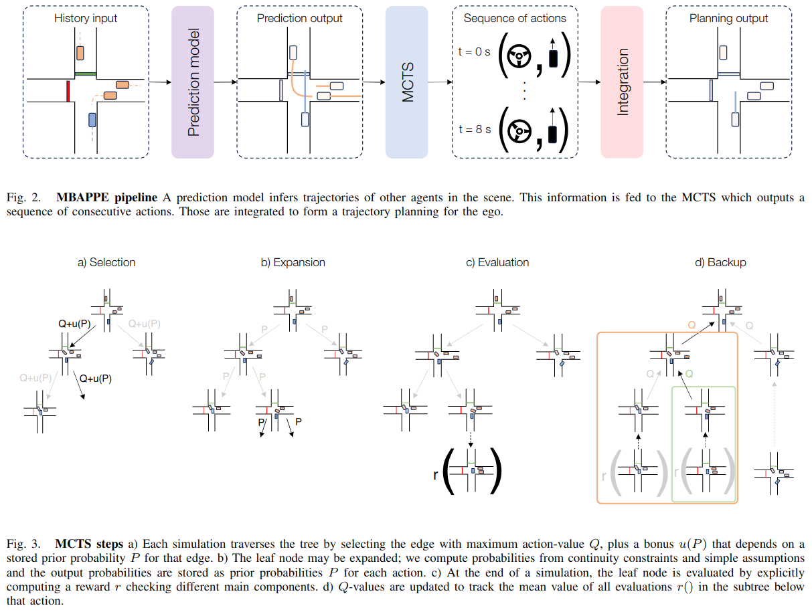

# MBAPPE: Mcts-Built-Around Prediction for Planning Explicitly

This repository contains the code for the MBAPPE paper: [MBAPPE: Mcts-Built-Around Prediction for Planning Explicitly](https://arxiv.org/abs/2309.08452). 

<p align="center">
    
</p>

This video presents a vizualisation of MBAPPE's exploration process and choice in different scenarios:


<div align="center">
  <a href="https://www.youtube.com/watch?v=EzgHDyH7RfI"></a>
</div>


## Installation

## Download the nuPlan dataset

You can download the dataset here: https://www.nuscenes.org/nuplan#download.

We advise you to use the mini dataset for personal workstation (lighter version of the nuPlan dataset).


### Add nuPlan dataset path to environnement

Define NUPLAN_DATA_ROOT, NUPLAN_MAPS_ROOT and NUPLAN_EXP_ROOT in the running enviromnent. The nuplan dataset should be in the home user `$HOME`.

```bash
export NUPLAN_DATA_ROOT="$HOME/nuplan/dataset"
export NUPLAN_MAPS_ROOT="$HOME/nuplan/dataset/maps"
export NUPLAN_EXP_ROOT="$HOME/nuplan/exp"
```

### Clone MBAPPE
```bash
git clone git@github.com:raphychek/mbappe-nuplan.git
cd mbappe-nuplan
```

### Install the packages
The project have been tested with Python 3.9.
```bash
# Using conda
conda env create -f environment.yml
conda activate nuplan

# Or using venv
python3 -m venv venv
source venv/bin/activate
pip install -r requirements.txt
pip install -r requirements-torch.txt

# Then install the project
pip install -e .
```

### Run caching to prepare for Urban Driver training

```python
python run_caching.py
```

### Train a Urban Driver for multi-agent model

```python
python run_training.py
```

### Run simulation with MCTS
First, set the variable "MODEL_PATH" in run_simulator.py to the trained weights path of the Urban Driver multi agents. Then:

```python
python run_simulation.py
```

### Run nuBoard 
First, set the variable "experiment_path" in run_nuboard.py to the logs path of the simulation. Then:

```python
python run_nuboard.py
```

### Note
This is a simplified implementation of MBAPPE. MCTS functions are in regular Python instead of jax to avoid compatibility issues and compilation requirements. 

Code related to the nuPlan devkit comes from https://github.com/motional/nuplan-devkit.

### Current limitations
Internal MCTS simulations suppose lane width to be constant. This sometimes leads to nearly impossible situations with extremely narrow turns. Real lane width can be fetched from the API, but it has not been implemented yet. This should significantly improve results. 

If you find our code or paper useful, please cite:


```bibtex
@misc{chekroun2023mbappe,
      title={MBAPPE: MCTS-Built-Around Prediction for Planning Explicitly}, 
      author={Raphael Chekroun and Thomas Gilles and Marin Toromanoff and Sascha Hornauer and Fabien Moutarde},
      year={2023},
      eprint={2309.08452},
      archivePrefix={arXiv},
      primaryClass={cs.RO}
}
```

This repository is managed by Raphael Chekroun (raphychek), Thomas Gilles (Thomas0Gilles) and Valentin Charraut (vcharraut).

